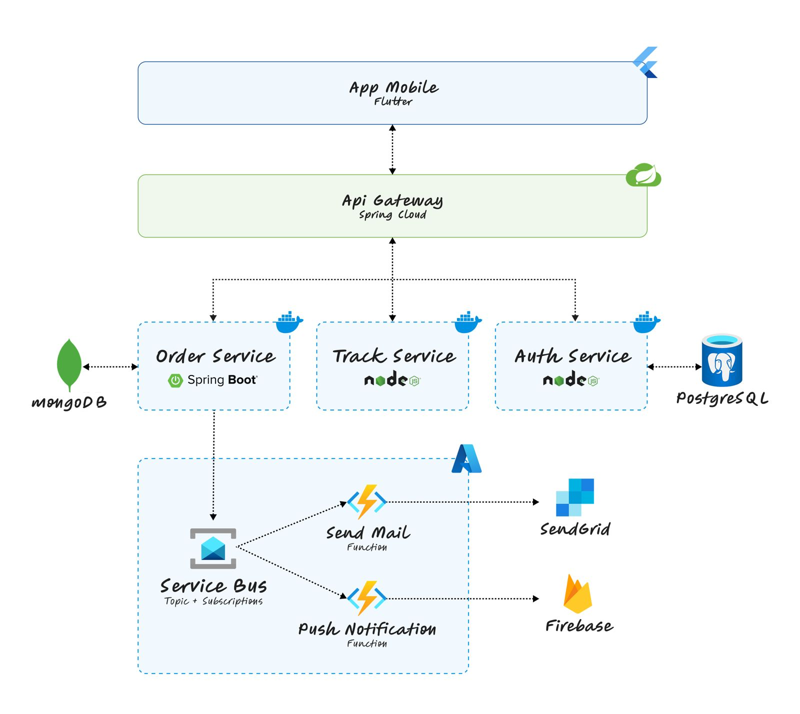

# 📦 Delivery System

Um sistema completo de entregas desenvolvido como projeto acadêmico na PUC Minas, implementando uma arquitetura moderna com aplicativo móvel Flutter, microsserviços em backend e infraestrutura serverless na nuvem.

## 🎥 Demonstração

> 📂 Os vídeos de demonstração estão organizados na pasta [`docs/videos`](docs/videos) deste repositório.

<p align="center">
  <a href="https://www.youtube.com/watch?v=tKkOWpcZqjU" target="_blank" style="text-decoration: none;">
    
    <br><br>
    
    <br><br>
    <strong style="color: #333; font-family: Arial, sans-serif; font-size: 18px;">🎬 Demonstração Completa: Mobile + Microsserviços + Serverless</strong>
  </a>
</p>

<p align="center" style="color: #666; font-style: italic; margin-top: 10px;">
  Vídeo demonstrando todas as funcionalidades do sistema integrado
</p>

## 🚀 Visão Geral

O projeto Delivery é uma solução completa para gerenciamento e rastreamento de entregas, oferecendo interfaces dedicadas para clientes e motoristas. O sistema foi desenvolvido seguindo os princípios de arquitetura moderna, com foco em escalabilidade, performance e experiência do usuário.

**Principais características:**
- 📱 Aplicativo móvel híbrido desenvolvido em Flutter
- 🔧 Arquitetura de microsserviços para o backend
- ☁️ Integração com Azure Functions para processamento serverless
- 📍 Rastreamento em tempo real com geolocalização
- 🔔 Sistema de notificações push e emails
- 📸 Captura de fotos para comprovação de entrega
- 🐰 Comunicação assíncrona via RabbitMQ

## 🏗️ Prévia da arquitetura
<p align="center">
  

  Mais detalhes sobre a arquitetura estão disponíveis na documentação do 
  **Backend**: [`backend/README.md`](backend/README.md)

## 📁 Estrutura do Projeto

```
delivery/
├── mobile/                   # Aplicativo móvel Flutter
│   ├── lib/                  # Código fonte Dart
│   ├── android/              # Configurações Android
│   ├── ios/                  # Configurações iOS
│   └── pubspec.yaml          # Dependências Flutter
│
├── backend/                  # Microsserviços e API Gateway
│   ├── docker-compose.yml    # Orquestração dos serviços
│   ├── api-gateway/          # Gateway de APIs (Spring Cloud Gateway)
│   ├── auth-service/         # Serviço de autenticação (Node.js)
│   ├── order-service/        # Serviço de pedidos (Java 21)
│   ├── tracking-service/     # Serviço de rastreamento (Node.js)
│   ├── setup-all.sh/.bat     # Scripts de configuração automática
│   ├── .env.example          # Exemplo de variáveis de ambiente
│   └── README.md            # Documentação do backend
│
├── cloud/                    # Infraestrutura cloud
│   └── functions-sb/         # Funções serverless Azure
│       ├── src/              # Código das funções
│       ├── package.json      # Dependências Node.js
│       └── host.json         # Configurações Azure Functions
│
└── docs/                     # Documentação do projeto
  ├── diagramas/            # Diagramas de arquitetura
  ├── especificacoes_entregas/ # Especificações das entregas
  └── videos/               # Vídeos de demonstração
```

## 🏗️ Fases do Desenvolvimento

### Fase 1: Desenvolvimento Mobile - [Docs](docs/especificacoes_entregas/entrega_01.md)
A primeira fase focou na criação do aplicativo móvel usando Flutter, implementando interfaces distintas para clientes e motoristas. O app inclui funcionalidades como rastreamento em tempo real, histórico de pedidos, captura de fotos com geolocalização para comprovação de entrega, e armazenamento offline com SQLite. Também foram implementadas notificações push, sistema de preferências com Shared Preferences, e tratamento robusto de erros para cenários como falta de conectividade e permissões negadas.

### Fase 2: Arquitetura de Microsserviços - [Docs](docs/especificacoes_entregas/entrega_02.md)
Na segunda fase, foi desenvolvido o backend utilizando arquitetura de microsserviços, criando serviços independentes para autenticação (com JWT), gerenciamento de pedidos (CRUD completo), rastreamento em tempo real, e notificações. A comunicação entre serviços foi implementada tanto de forma síncrona (REST) quanto assíncrona (mensageria), com um API Gateway centralizando o roteamento e autenticação. Esta arquitetura garante escalabilidade, manutenibilidade e isolamento de falhas.

### Fase 3: Infraestrutura Serverless - [Docs](docs/especificacoes_entregas/entrega_03.md)
A fase final integrou componentes serverless na arquitetura existente, complementando os microsserviços tradicionais com funções serverless (Azure Functions) e serviços gerenciados. Esta implementação inclui um sistema de notificações robusto baseado em funções serverless, integração entre RabbitMQ e Azure Functions para processamento assíncrono de emails e notificações push, e gerenciamento de eventos em tempo real. O resultado é uma infraestrutura híbrida que combina a confiabilidade dos microsserviços com a escalabilidade e o baixo custo operacional das funções serverless.

## 🚀 Como Executar o Projeto

### Pré-requisitos
- Flutter SDK (versão 3.0+)
- Dart SDK
- Android Studio / Xcode (para desenvolvimento mobile)
- Docker (para microsserviços)
- Node.js 20+ (para serviços Node.js)
- Java 21 JDK (para serviços Java)
- Maven (incluído nos wrappers dos projetos)
- Conta Azure (para funções serverless)

### Executando o Mobile
```bash
cd mobile/
flutter pub get
flutter run
```

### Executando os Microsserviços

1. Navegue até a pasta backend:
```bash
cd backend/
```

2. Configure as variáveis de ambiente:
```bash
cp .env.example .env
# Edite o .env conforme necessário
```

3. Execute o setup automático:

**Windows:**
```bash
./setup-all.bat
```

**Linux/Mac:**
```bash
chmod +x setup-all.sh
./setup-all.sh
```

**Ou manualmente:**
```bash
docker-compose up --build -d
```

O sistema iniciará os seguintes serviços:
- **API Gateway** (porta 8000): Ponto de entrada único para todas as APIs
- **Auth Service** (porta 3000): Gerencia autenticação e JWT
- **Order Service** (porta 8080): Gerenciamento de pedidos
- **Tracking Service** (porta 8081): Rastreamento em tempo real
- **MongoDB**: Banco de dados para autenticação
- **PostgreSQL**: Bancos de dados para pedidos e rastreamento
- **RabbitMQ**: Sistema de mensageria

### Deploy Serverless (Azure Functions)

1. Navegue até a pasta de funções:
```bash
cd functions-sb/
```

2. Instale as dependências:
```bash
npm install
```

3. Configure as variáveis de ambiente para Azure:
```bash
# Configure conforme sua conta Azure
```

4. Deploy para Azure:
```bash
# Comandos específicos de deploy Azure Functions
func azure functionapp publish <nome-da-function-app>
```

## 🌐 URLs dos Serviços

Após a execução bem-sucedida, os serviços estarão disponíveis em:

| Serviço | URL | Descrição |
|---------|-----|-----------|
| **🌐 API Gateway** | http://localhost:8000 | Ponto de entrada principal |
| **🔐 Auth Service** | http://localhost:3000 | Autenticação e autorização |
| **📦 Order Service** | http://localhost:8080 | Gerenciamento de pedidos |
| **📍 Tracking Service** | http://localhost:8081 | Rastreamento em tempo real |
| **📖 Tracking Docs** | http://localhost:8081/api/docs | Documentação Swagger |
| **🐰 RabbitMQ** | http://localhost:15672 | Management UI |

### Bancos de Dados
| Banco | Host | Porta | Usuário | Senha |
|-------|------|-------|---------|-------|
| **PostgreSQL (Orders)** | localhost | 5432 | delivery_user | delivery_pass |
| **PostgreSQL (Tracking)** | localhost | 5433 | root | root |
| **MongoDB** | localhost | 27017 | root | rootpassword |

## 🧪 Testando o Sistema

### Verificação Rápida
```bash
# Health check de todos os serviços
curl http://localhost:3000/health       # Auth
curl http://localhost:8080/health       # Orders  
curl http://localhost:8081/api/tracking/health  # Tracking
curl http://localhost:8000/health       # Gateway
```

### Teste via API Gateway
```bash
# Todas as requisições devem passar pelo gateway
curl http://localhost:8000/api/auth/health
curl http://localhost:8000/api/orders/health
curl http://localhost:8000/api/tracking/health
```

## 🔧 Comandos Úteis

```bash
# Ver logs de todos os serviços
docker-compose logs -f

# Ver logs de um serviço específico
docker-compose logs -f tracking-service

# Parar todos os serviços
docker-compose down

# Reconstruir e reiniciar tudo
docker-compose down && docker-compose up --build -d

# Ver status dos containers
docker-compose ps
```

## 📚 Documentação

Para informações detalhadas sobre arquitetura, APIs e deployment, consulte:

- **Backend**: [`backend/README.md`](backend/README.md)
- **Tracking Service**: [`backend/tracking-service/README.md`](backend/tracking-service/README.md)
- **Especificações**: [`docs/especificacoes_entregas/`](docs/especificacoes_entregas/)

## 🛠️ Tecnologias Utilizadas

- **Mobile:** Flutter, Dart, SQLite, GPS, Camera
- **Backend:** Spring Boot, Node.js, PostgreSQL, MongoDB, RabbitMQ
- **Cloud:** Azure Functions, Azure Service Bus
- **DevOps:** Docker, Docker Compose, Maven
- **Documentação:** Swagger/OpenAPI

## 📈 Características do Sistema

### 🔒 Segurança
- ✅ Autenticação JWT compartilhada entre serviços
- ✅ Redes Docker isoladas
- ✅ Validação de dados nas APIs
- ✅ Sanitização de inputs

### 📊 Escalabilidade
- ✅ Arquitetura de microsserviços independentes
- ✅ Comunicação assíncrona via RabbitMQ
- ✅ Funções serverless para picos de demanda
- ✅ Bancos de dados específicos por domínio

### 🔍 Observabilidade
- ✅ Health checks em todos os serviços
- ✅ Logs estruturados e centralizados
- ✅ Documentação Swagger interativa
- ✅ Monitoramento de recursos

### 🚀 DevOps
- ✅ Containerização completa com Docker
- ✅ Orquestração via Docker Compose
- ✅ Scripts de setup automatizados
- ✅ Deploy serverless via Azure Functions

---
